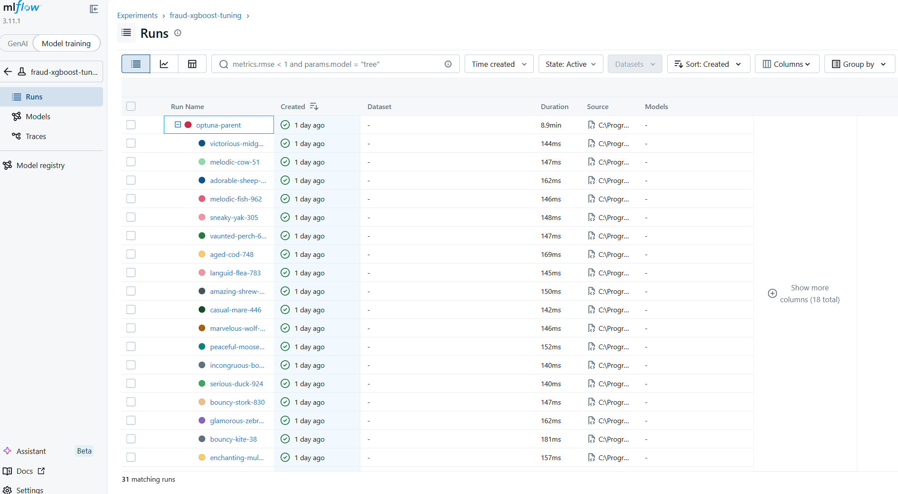

# Fraud Detection ML System

[](https://python.org)
[](https://xgboost.readthedocs.io)
[](https://scikit-learn.org)
[](https://fastapi.tiangolo.com)
[](https://mlflow.org)
[](https://fraud-detection-api-5gno.onrender.com)

End-to-end machine learning pipeline for real-time payment fraud detection. Built on 284,807 real credit card transactions with extreme class imbalance (575:1). Full production system from exploratory analysis to deployed REST API.

## Pipeline Overview

`01 EDA` → `02 Baseline` → `03 Imbalance Handling` → `04 XGBoost + Optuna` → `05 SHAP` → `06 Threshold Tuning` → `07 API Deployment`

---

## Results

| Stage | Model | PR-AUC |
|---|---|---|
| Baseline | Logistic Regression (default) | 0.73 |
| Imbalance handling | Logistic Regression + SMOTE | 0.76 |
| Gradient boosting | XGBoost (default) | 0.82 |
| **Tuned** | **XGBoost + Optuna (150 trials)** | **0.88** |

Threshold was further optimised from the default 0.5 down to **0.28** using a business cost matrix (a missed fraud costs ~10× more than a false block), improving recall on the held-out test set without a significant drop in precision.

---

## Experiment Tracking

All Optuna hyperparameter trials are logged to MLflow via DagsHub, recording parameters, PR-AUC, and artefact paths for every run — making it straightforward to compare runs and reproduce the best model.

**Live MLflow UI:** https://dagshub.com/Zuleikha/fraud-detection-ML-project.mlflow



Live API: https://fraud-detection-api-5gno.onrender.com

---

## Tech Stack

| Layer | Libraries |
|---|---|
| Data & features | pandas, NumPy, scikit-learn, imbalanced-learn |
| Modelling | XGBoost, Optuna |
| Explainability | SHAP |
| Experiment tracking | MLflow |
| API | FastAPI, Uvicorn, Pydantic |
| Testing | pytest, httpx |
| Deployment | Render (Docker-less, via `render.yaml`) |

---

## Project Structure

```
fraud-detection-ml/
├── notebooks/
│   ├── 01_eda.ipynb                  # Exploratory analysis — class imbalance, feature distributions
│   ├── 02_baseline_model.ipynb       # Logistic regression baseline to beat (PR-AUC 0.73)
│   ├── 03_imbalance_handling.ipynb   # SMOTE, undersampling, class weights comparison
│   ├── 04_xgboost_tuning.ipynb       # XGBoost + Optuna (150 trials) logged to MLflow
│   ├── 05_shap_explainability.ipynb  # SHAP summary/waterfall plots for the best model
│   ├── 06_threshold_tuning.ipynb     # Cost-matrix threshold sweep → threshold = 0.28
│   └── 07_api_and_deployment.ipynb   # FastAPI smoke-test and Render deployment walkthrough
├── src/
│   ├── features.py    # Feature engineering (time features, velocity windows, preprocessor)
│   ├── train.py       # Model training pipeline
│   └── predict.py     # Inference helpers
├── app/
│   └── main.py        # FastAPI app (30 named features, threshold-aware /predict)
├── api/
│   └── main.py        # Alternative minimal API endpoint
├── docs/              # Markdown study notes (01 → 07), matching each notebook
├── outputs/
│   ├── models/        # Serialised model artefacts (best_xgb.pkl)
│   └── figures/       # SHAP plots and evaluation charts
├── tests/
│   └── test_predict.py
├── requirements.txt
└── render.yaml        # Render deployment config
```

---

## How to Run Locally

### 1. Clone and create a virtual environment

```bash
git clone https://github.com/Zuleikha/fraud-detection-ML-project.git
cd fraud-detection-ml

python -m venv .venv
# macOS / Linux
source .venv/bin/activate
# Windows
.venv\Scripts\activate
```

### 2. Install dependencies

```bash
pip install -r requirements.txt
```

### 3. Download the dataset from Kaggle

The project uses the [Credit Card Fraud Detection](https://www.kaggle.com/datasets/mlg-ulb/creditcardfraud) dataset.

```bash
# Install the Kaggle CLI if you haven't already
pip install kaggle

# Place your kaggle.json API token in ~/.kaggle/ then run:
kaggle datasets download -d mlg-ulb/creditcardfraud -p data/raw/ --unzip
```

The file `data/raw/creditcard.csv` should now exist (~144 MB).

### 4. Run the notebooks in order

Launch Jupyter and open each notebook in sequence:

```bash
jupyter notebook notebooks/
```

Run them in order: `01` → `02` → `03` → `04` → `05` → `06` → `07`.
Each notebook saves its outputs (models, figures) to `outputs/` for the next to consume.

### 5. Start the API locally

```bash
uvicorn app.main:app --reload
```

The API will be available at `http://localhost:8000`. Interactive docs at `http://localhost:8000/docs`.

---

## Live API

The model is deployed on Render:

**Base URL:** `https://fraud-detection-api-5gno.onrender.com`

| Endpoint | Method | Description |
|---|---|---|
| `/health` | GET | Health check |
| `/predict` | POST | Returns fraud probability and binary prediction |

### Example — predict a transaction

```bash
curl -s -X POST https://fraud-detection-api-5gno.onrender.com/predict \
  -H "Content-Type: application/json" \
  -d '{
    "V1": -1.3598, "V2": -0.0728, "V3": 2.5363, "V4": 1.3782, "V5": -0.3383,
    "V6": 0.4624, "V7": 0.2396, "V8": 0.0987, "V9": 0.3638, "V10": 0.0908,
    "V11": -0.5516, "V12": -0.6178, "V13": -0.9914, "V14": -0.3112, "V15": 1.4682,
    "V16": -0.4704, "V17": 0.2080, "V18": 0.0258, "V19": 0.4040, "V20": 0.2514,
    "V21": -0.0183, "V22": 0.2778, "V23": -0.1105, "V24": 0.0669, "V25": 0.1285,
    "V26": -0.1892, "V27": 0.1336, "V28": -0.0211,
    "log_amount": 3.64,
    "hour_of_day": 14.0
  }'
```

**Response:**

```json
{
  "fraud_probability": 0.0312,
  "is_fraud": false,
  "threshold_used": 0.28
}
```

> **Note:** Render free-tier instances spin down after inactivity. The first request may take up to 30 seconds while the instance wakes up.

---

## GitHub Repository

[https://github.com/Zuleikha/fraud-detection-ML-project](https://github.com/Zuleikha/fraud-detection-ML-project)
